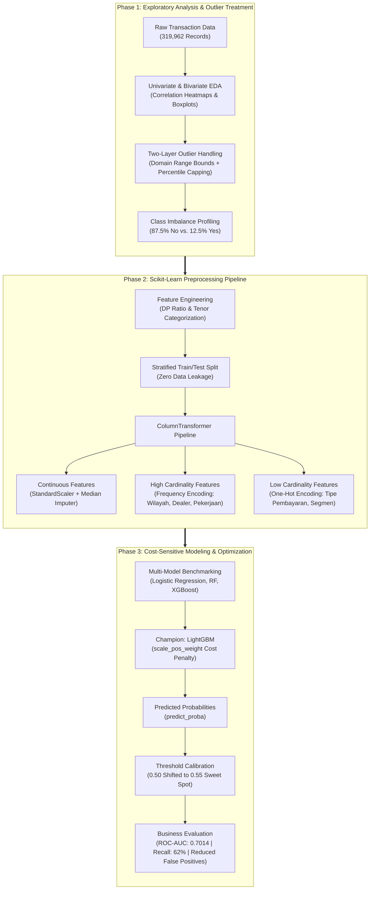

# Repeat Order Prediction — Cost-sensitive machine learning pipeline predicting vehicle repeat purchase behavior under extreme class imbalance


---
🏆 **SPARC 2026 Data Science Competition — Finalist**  
Organized by Universitas Ciputra | Developed by **Team STRIVE**
---

## Project Overview
This repository contains Team STRIVE's finalist submission for the SPARC 2026 Data Science Competition hosted by Universitas Ciputra. The core objective of the project is to assist automotive financing companies in prioritizing customer follow-ups for repeat vehicle purchases based on a large-scale historical transaction database of 319,962 records.

Rather than relying purely on standard accuracy, the team engineered a **Cost-Sensitive Machine Learning Pipeline** powered by **LightGBM**. By confronting an extreme class imbalance (~87.5% non-repeat buyers vs. ~12.5% repeat buyers) and optimizing decision thresholds, the solution strategically balances capturing high-potential returning customers (True Positives) with minimizing costly telemarketing misallocations (False Positives).

## Key Features
- **Two-Tier Outlier Remediation**: Combined automotive domain business-logic validation with statistical percentile capping across sensitive financial indicators (OTR price, actual down payments, and installments).
- **Leak-Free Scikit-Learn Pipeline**: Integrated custom feature engineering (`DP Ratio`, `Tenor Categories`), rare category clustering (<1,000 counts into `Other`), frequency encoding for high-cardinality features, and one-hot encoding within isolated train/test splits.
- **Extreme Class Imbalance Mitigation**: Implemented algorithmic cost compensation (`scale_pos_weight`) inside LightGBM to heavily penalize minority class misclassification without relying on artificial synthetic sampling.
- **Cost-Sensitive Threshold Optimization**: Calibrated the decision probability threshold from the default 0.50 to a fine-tuned **0.55 sweet spot**, boosting precision while sustaining a 62% Recall rate on actual repeat buyers.
- **Multi-Model Benchmark**: Rigorously compared four distinct machine learning architectures: Logistic Regression (baseline), Random Forest, XGBoost, and LightGBM, selecting LightGBM for its superior speed, memory efficiency, and tabular performance (0.7014 ROC-AUC).
- **Data-Driven Business Intelligence**: Demonstrated that customer repeat decisions are predominantly governed by financial burden indicators rather than demographic variables like age, uncovering key behavioral insights for targeted marketing.

## My Roles & Contributions
- **Teamwork & Collaborative Problem Solving**
  - Collaborated actively within our 3-person team (**Team STRIVE**) across the entire competition, working closely to analyze the automotive financing business scenario and formulate our end-to-end data science strategy.
  - Brainstormed iterative analytical approaches with teammates, ensuring seamless continuity between exploratory analysis, preprocessing pipelines, and final model evaluation.
- **Tackling the Imbalanced Data Challenge**
  - Together with the team, tackled the central technical challenge of the competition: predicting repeat purchase behavior on a heavily skewed distribution (~137k negative vs. ~19k positive records).
  - Implemented cost-sensitive machine learning via LightGBM's `scale_pos_weight` parameter, adjusting class penalty weights to capture minority repeat-buyer signals without synthesizing artificial data.
  - Fine-tuned classification decision boundaries, shifting the probability cutoff to 0.55 to achieve an optimal balance between catching potential returning buyers (62% Recall) and drastically reducing expensive telemarketing errors (False Positives).
- **Pipeline Verification & Model Benchmarking**
  - Co-verified Scikit-Learn pipeline transformers (`ColumnTransformer`, `StandardScaler`, `OneHotEncoder`, `SimpleImputer`), ensuring zero data leakage across stratified train and test partitions.
  - Benchmarked model families (Logistic Regression, Random Forest, XGBoost, LightGBM), identifying LightGBM as the most reliable, computationally efficient solution (0.7014 ROC-AUC).
- **Reporting & Business Impact Translation**
  - Contributed to synthesizing empirical findings into the final competition submission, translating feature importance findings and cost-benefit trade-offs into practical strategic recommendations.

## Architecture
The analytical pipeline spans three integrated phases designed for reproducibility, statistical rigor, and business efficiency:



1. **Exploratory Data Analysis**: Evaluates 319,962 transactions, addresses severe financial outliers, and identifies the class imbalance challenge.
2. **Preprocessing Pipeline**: Structures numerical scaling, frequency encoding for high-cardinality columns, and one-hot encoding inside a unified `ColumnTransformer`.
3. **Modeling & Cost Calibration**: Applies class-weighted LightGBM and tunes decision thresholds to 0.55, maximizing ROI and telemarketing conversion.

## Folder Structure
```
SPARC-Repeat-Order-Prediction/
├── EDA_FINAL.ipynb              # Exploratory data analysis, univariate/bivariate distributions, and outlier handling
├── PreProcessing_FINAL.ipynb    # Leak-free Scikit-Learn data transformation, encoding, and scaling pipeline
├── ML_FINAL.ipynb               # Model benchmarking (LogReg, RF, XGBoost, LightGBM), cost-sensitive tuning, and evaluation
├── requirements.txt             # Python environment dependencies
├── .gitignore                   # Excludes raw datasets (>50MB), competition archives, and cache
└── README.md                    # Project documentation
```

## Installation

### Prerequisites
- Python 3.10 or higher
- Git

### Steps
1. Clone the repository:
   ```bash
   git clone https://github.com/EdwinAntoniee/SPARC-Repeat-Order-Prediction.git
   cd SPARC-Repeat-Order-Prediction
   ```

2. Create and activate a virtual environment:
   - **Windows (PowerShell):**
     ```powershell
     python -m venv venv
     .\venv\Scripts\Activate.ps1
     ```
   - **macOS / Linux:**
     ```bash
     python3 -m venv venv
     source venv/bin/activate
     ```

3. Install required dependencies:
   ```bash
   pip install -r requirements.txt
   ```

4. Launch the Jupyter Notebook interface:
   ```bash
   jupyter notebook
   ```

5. Execute the notebooks in sequential order:
   - `EDA_FINAL.ipynb` — Run exploratory data analysis and outlier cleaning
   - `PreProcessing_FINAL.ipynb` — Execute the Scikit-Learn preprocessing pipeline
   - `ML_FINAL.ipynb` — Train and evaluate cost-sensitive models with threshold optimization
